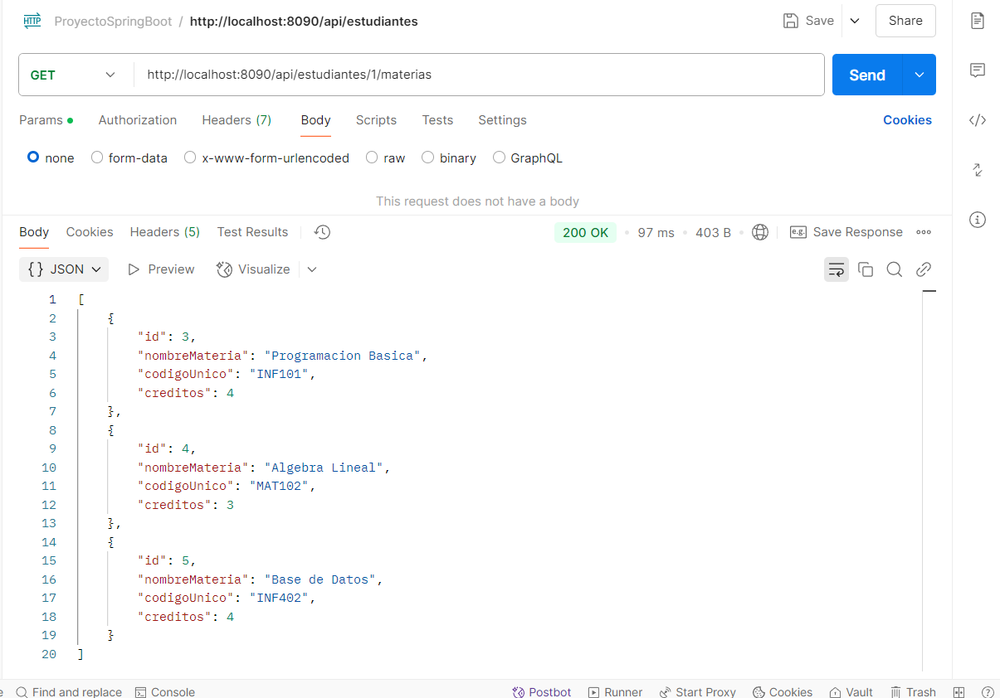
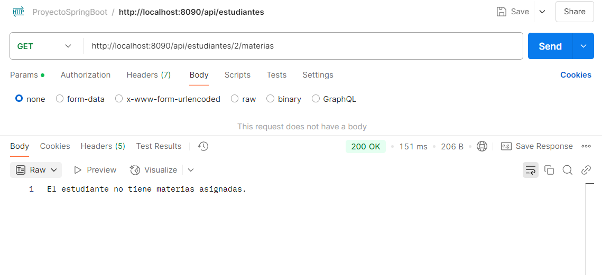

# Grupo 4 - Proyecto Gestion Universidad

Este proyecto es una API para gestionar estudiantes y materias. A continuación se documenta una operación implementada recientemente:

completar las repuestas teoricas preguntas
---

## 1. Obtener Materias por Estudiante (Usando `Optional`)

Esta operación permite obtener la lista de materias asociadas a un estudiante específico mediante su ID. La implementación utiliza `Optional` para manejar de forma segura los posibles valores nulos y listas vacías.

---

### Interfaz del Servicio - `IEstudianteService.java`

```java
Optional<List<Materia>> obtenerMateriasDeEstudiante(Long estudianteId);
```
### Implementacion del Servicio - `EstudianteServiceImpl.java`

```java
@Override
public Optional<List<Materia>> obtenerMateriasDeEstudiante(Long estudianteId) {
    Optional<Estudiante> estudianteOptional = estudianteRepository.findById(estudianteId);
    return estudianteOptional.map(Estudiante::getMaterias);
}
```

### Controlador estudiante - `EstudianteController.java`

```java
@GetMapping("/{id}/materias")
public ResponseEntity<?> obtenerMateriasDeEstudiante(@PathVariable("id") Long estudianteId) {
    Optional<List<Materia>> materiasOptional = estudianteService.obtenerMateriasDeEstudiante(estudianteId);
    return materiasOptional.map(materias -> {
                if (materias.isEmpty()) {
                    return ResponseEntity.ok("El estudiante no tiene materias asignadas.");
                } else {
                    return ResponseEntity.ok().body(materias);
                }
            })
            .orElseGet(() -> ResponseEntity.notFound().build());
}
```
### Consulta a la API con Postman
Realizamos la consulta con el metodo GET http://localhost:8090/api/estudiantes/1/materias

Ahora en caso de una lista vacia de materias nos devolvera
